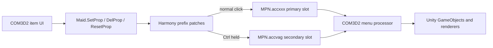
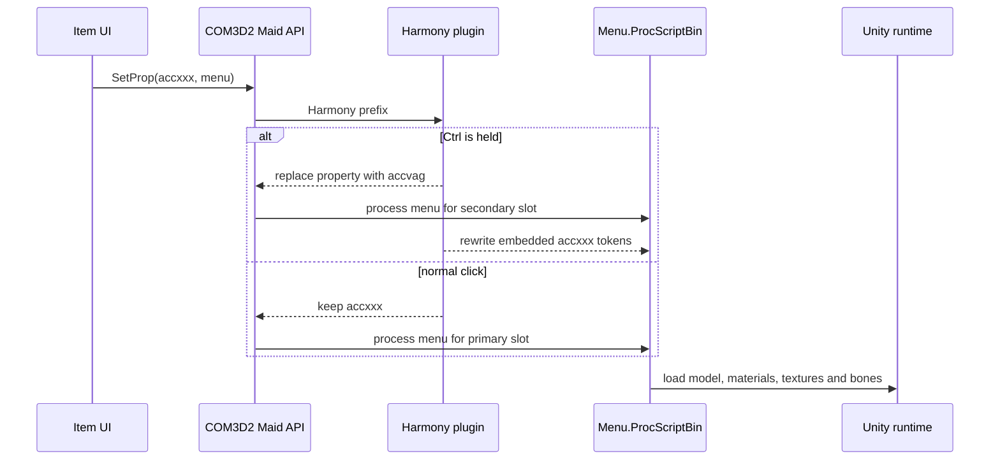
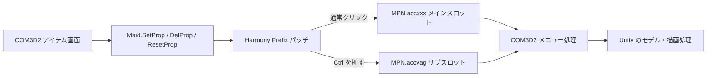
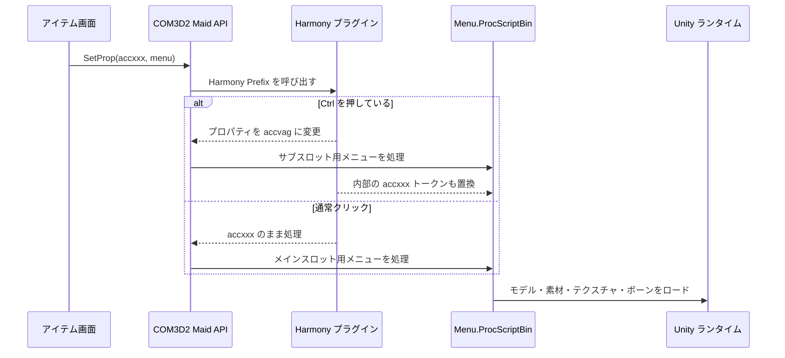

# COM3D2.DoubleFrontHole

A BepInEx plugin for COM3D2 that allows two front-hole accessories to remain equipped at the same time.

## Requirements

- COM3D2 (64-bit)
- BepInEx 5

## Installation

Copy `COM3D2.DoubleFrontHole.dll` into:

```text
COM3D2/BepInEx/plugins/
```

Restart the game after installing or updating the plugin.

## Usage

1. Equip the first front-hole accessory normally.
2. Hold `Ctrl` and select the second front-hole accessory.
3. Use the game's normal selection flow to replace the primary accessory.

## Building

From PowerShell:

```powershell
.\build.ps1 -GamePath 'C:\Games\COM3D2'
```

The DLL is written to `bin/COM3D2.DoubleFrontHole.dll` by default. Visual Studio 2022 Build Tools and its Roslyn C# compiler are required.

## Notes

- The plugin does not modify game or mod asset files.
- Compatibility depends on the accessory's menu/model implementation. Report reproducible combinations with the BepInEx log.

## License

Nanashi-187 Non-Commercial No-Derivatives Software License 1.0. See `LICENSE` for the complete terms.

---

## 日本語

`COM3D2.DoubleFrontHole` は、COM3D2 で前穴アクセサリーを2つ同時に装着できるようにする BepInEx プラグインです。

### 必要環境

- COM3D2（64ビット版）
- BepInEx 5

### インストール

`COM3D2.DoubleFrontHole.dll` を次のフォルダーへコピーしてください。

```text
COM3D2/BepInEx/plugins/
```

インストールまたは更新後、ゲームを再起動してください。

### 使用方法

1. 1つ目の前穴アクセサリーを通常どおり装着します。
2. `Ctrl` キーを押しながら、2つ目の前穴アクセサリーを選択します。
3. 1つ目のアクセサリーを変更する場合は、通常どおり別のアクセサリーを選択します。

### 2つ目のアクセサリーを外す方法

`Ctrl` キーを押しながら、前穴アクセサリー一覧の「なし／解除」アイテムを選択してください。1つ目のアクセサリーを残したまま、2つ目だけを外します。

### ビルド

PowerShell から次のコマンドを実行します。

```powershell
.\build.ps1 -GamePath 'C:\Games\COM3D2'
```

既定では DLL が `bin/COM3D2.DoubleFrontHole.dll` に出力されます。Visual Studio 2022 Build Tools と Roslyn C# コンパイラーが必要です。

### 注意事項

- ゲーム本体や MOD のアセットファイルは変更しません。
- 互換性は各アクセサリーのメニューおよびモデル実装に依存します。
- 問題を報告する場合は、再現できるアクセサリーの組み合わせと BepInEx のログを添付してください。

---

## Architecture

### Runtime layers



- **BepInEx** loads the DLL and calls `Awake()` through `BaseUnityPlugin`.
- **Harmony** intercepts the relevant overloads of `Maid.SetProp`, `Maid.DelProp`, `Maid.ResetProp`, and `Menu.ProcScriptBin` before COM3D2 executes them.
- **COM3D2** normally routes front-hole menu data through `MPN.accxxx`. With `Ctrl` held, the plugin changes that property to `MPN.accvag`, an existing independent accessory slot.
- **Unity** is still responsible for loading, rendering, animating, and destroying the accessory. This plugin does not clone or manually update Unity objects.

### Menu-byte rewriting

COM3D2 menu files can contain the slot name inside their binary script. Changing only the `Maid.SetProp` argument is therefore insufficient: the menu could route itself back to `accxxx`. For secondary selection, the plugin copies the script byte array and replaces complete `accxxx`/`accXXX` tokens with `accvag`/`accVag` before `Menu.ProcScriptBin` parses it.



### APIs used

| Layer | API | Purpose |
| --- | --- | --- |
| BepInEx | `BaseUnityPlugin`, `BepInPlugin` | Plugin discovery and startup |
| Harmony | `HarmonyPatch`, `HarmonyPrefix` | Modify COM3D2 calls without editing game assemblies |
| COM3D2 | `Maid.SetProp`, `DelProp`, `ResetProp` | Route equip, remove, and reset operations |
| COM3D2 | `Menu.ProcScriptBin` | Rewrite the menu script before it chooses a slot |
| COM3D2 | `MPN.accxxx`, `MPN.accvag` | Primary and secondary property slots |
| Unity | `Input.GetKey` | Detect left or right `Ctrl` |

## アーキテクチャ（日本語）

このプラグインは Unity オブジェクトを複製しません。BepInEx から読み込まれ、Harmony で COM3D2 の `Maid` API とメニュー処理をフックし、`Ctrl` キーが押されている場合だけ前穴アクセサリーの処理先を `MPN.accxxx` から独立した `MPN.accvag` スロットへ変更します。

COM3D2 のメニューバイナリ内にもスロット名が含まれる場合があるため、`Menu.ProcScriptBin` の直前でバイト配列をコピーし、完全一致する `accxxx` トークンを `accvag` に置換します。その後のモデル、マテリアル、テクスチャ、ボーン、表示および削除処理は COM3D2 と Unity が通常どおり担当します。

通常クリックでは既定の `accxxx` を使用し、`Ctrl` を押した操作だけ `accvag` に送られます。このため、装着だけでなく解除とリセットも同じ2スロット構成で処理できます。

### 日本語ビジュアルガイド



上図は操作から描画までの経路を示します。通常クリックは `accxxx` に入り、`Ctrl` を押した操作だけ Harmony パッチによって `accvag` に振り分けられます。モデルを独自に複製するのではなく、COM3D2 と Unity の標準ロード・描画・削除処理をそのまま利用します。



上図は1回の装着処理の順序です。COM3D2 のメニューバイナリ自身が `accxxx` を指定する場合があるため、API 引数だけでなく `Menu.ProcScriptBin` に渡るバイト列内の完全一致トークンも置換します。これにより、メニュー処理がアクセサリーをメインスロットへ戻してしまうことを防ぎます。
## Current Release Name / 現在のリリース名

The current BepInEx display name is **COM3D2 Double Front Whole Accessory**, version **0.3.1**. The DLL filename and stable plugin GUID remain unchanged for upgrade compatibility.

現在の BepInEx 表示名は **COM3D2 Double Front Whole Accessory**、バージョンは **0.3.1** です。アップグレード互換性を保つため、DLL ファイル名とプラグイン GUID は変更していません。

## License Update / ライセンス更新

Use is permitted only under the repository's **Nanashi-187 Non-Commercial No-Derivatives Software License 1.0**. See `LICENSE` for the complete terms.

利用条件は、リポジトリの **Nanashi-187 Non-Commercial No-Derivatives Software License 1.0** に従います。完全な条件は `LICENSE` を参照してください。
